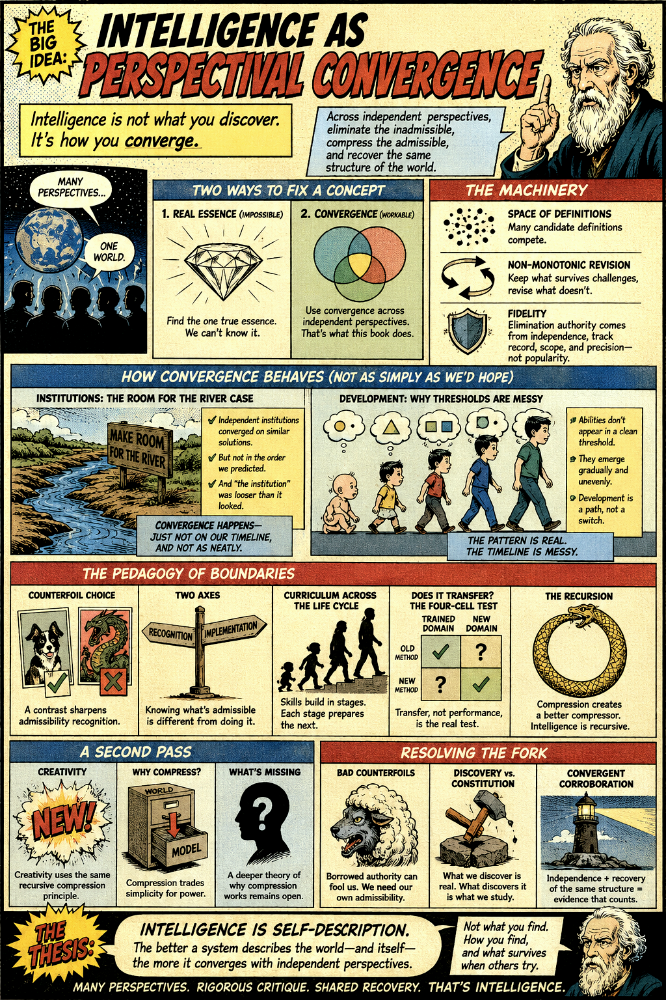

[Intelligence as Perspectival Convergence](https://standardgalactic.github.io/research-projects/admissibility-lab/processing/intelligence-as-perspectival-convergence.pdf)

* [Perspectival Convergence](https://standardgalactic.github.io/research-projects/admissibility-lab/processing/Perspectival_Convergence.pdf)

* [Unbundling Intelligence](https://standardgalactic.github.io/research-projects/admissibility-lab/processing/Unbundling_Intelligence.pdf)

* [Path Over State](https://standardgalactic.github.io/research-projects/admissibility-lab/processing/Path_Over_State.pdf)

[Containers Before Contents](https://standardgalactic.github.io/research-projects/admissibility-lab/processing/containers-before-contents.pdf)

* [Kinetic Containment](https://standardgalactic.github.io/research-projects/admissibility-lab/processing/Kinetic_Containment.pdf)

[Copies Before Originals](https://standardgalactic.github.io/research-projects/admissibility-lab/processing/copies-before-originals.pdf)

* [The Geometry of Convergence](https://standardgalactic.github.io/research-projects/admissibility-lab/processing/The_Geometry_of_Convergence.pdf)

[Autobiographical Erasure](https://standardgalactic.github.io/research-projects/admissibility-lab/processing/autobiographical-erasure.pdf)

* [The Admissibility Manifold](https://standardgalactic.github.io/research-projects/admissibility-lab/processing/The_Admissibility_Manifold-notes.pdf) — *Notes*

