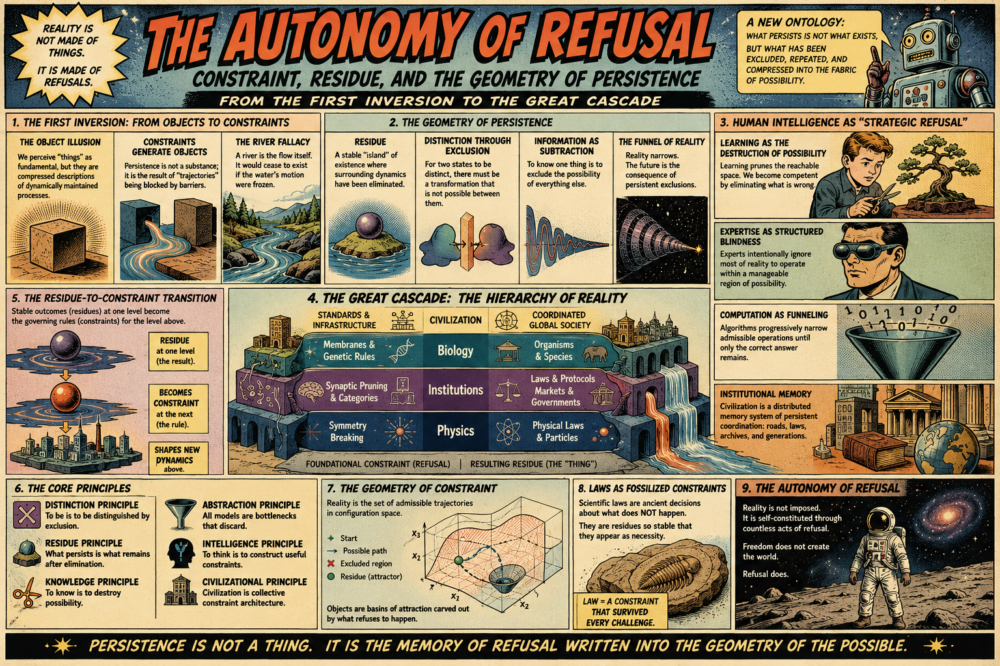
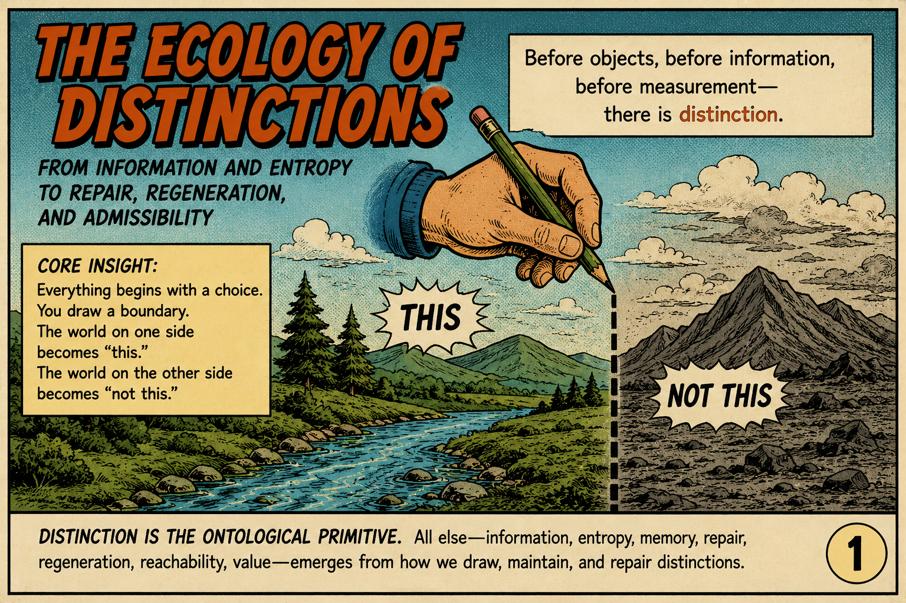
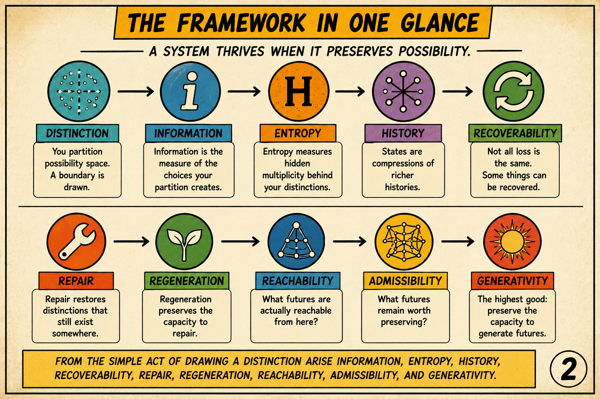
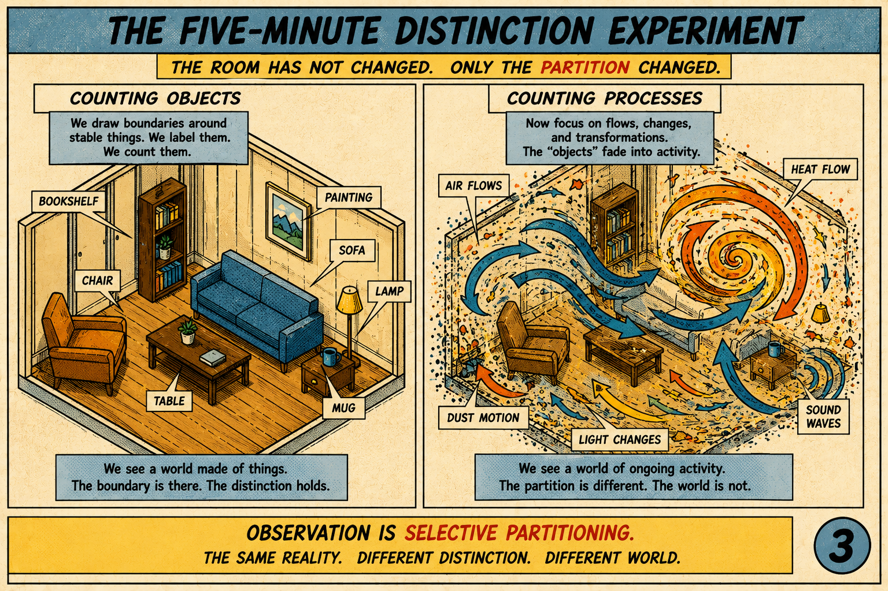
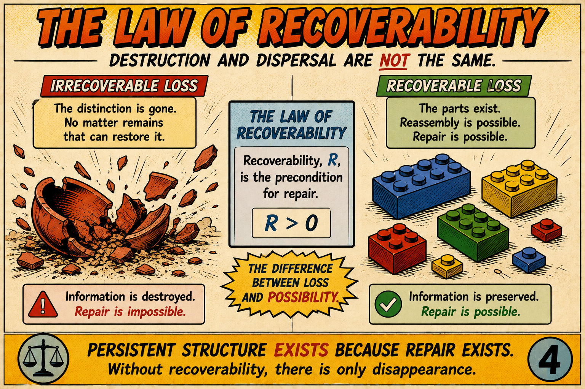
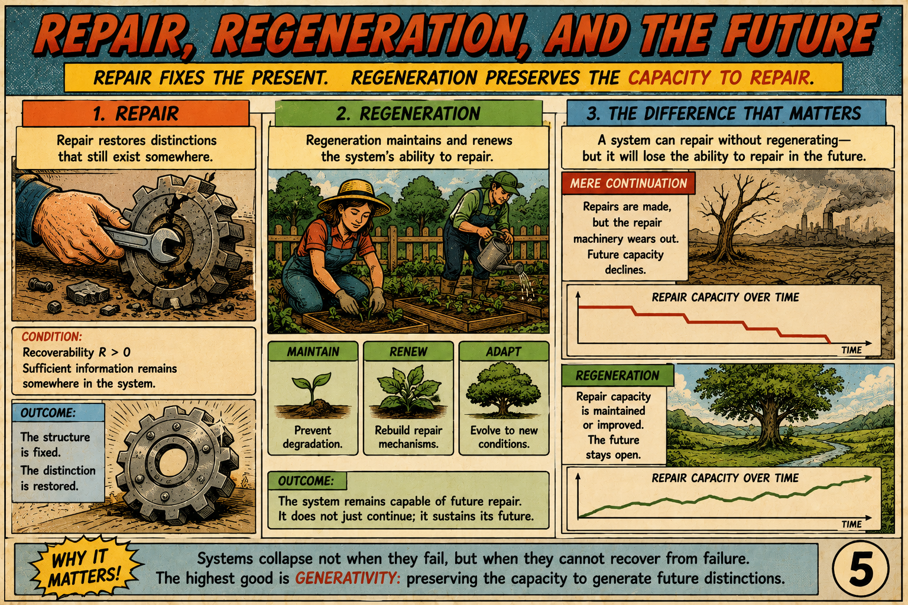
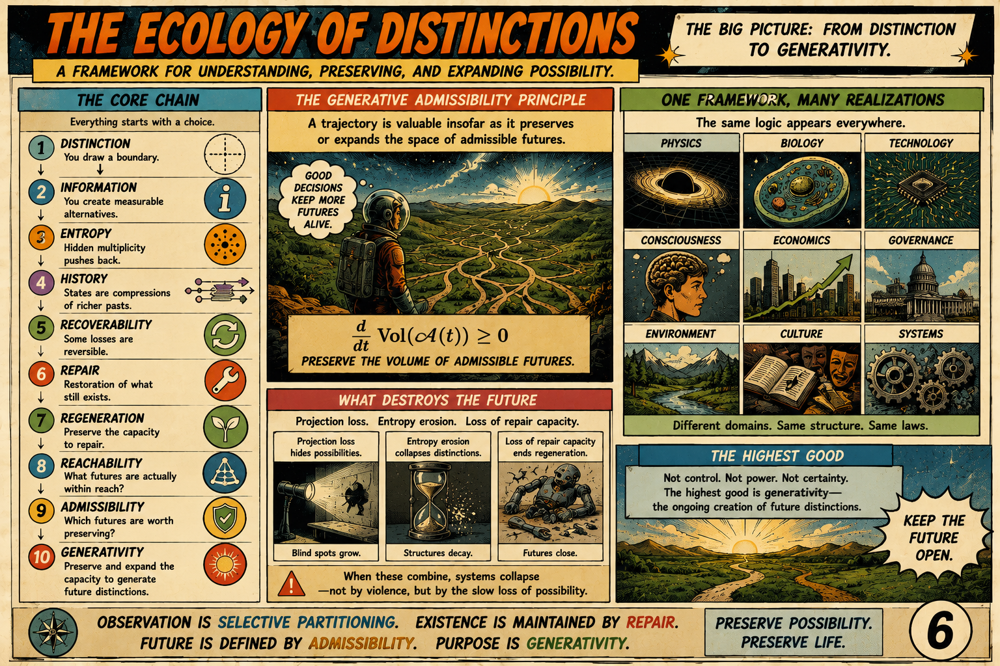
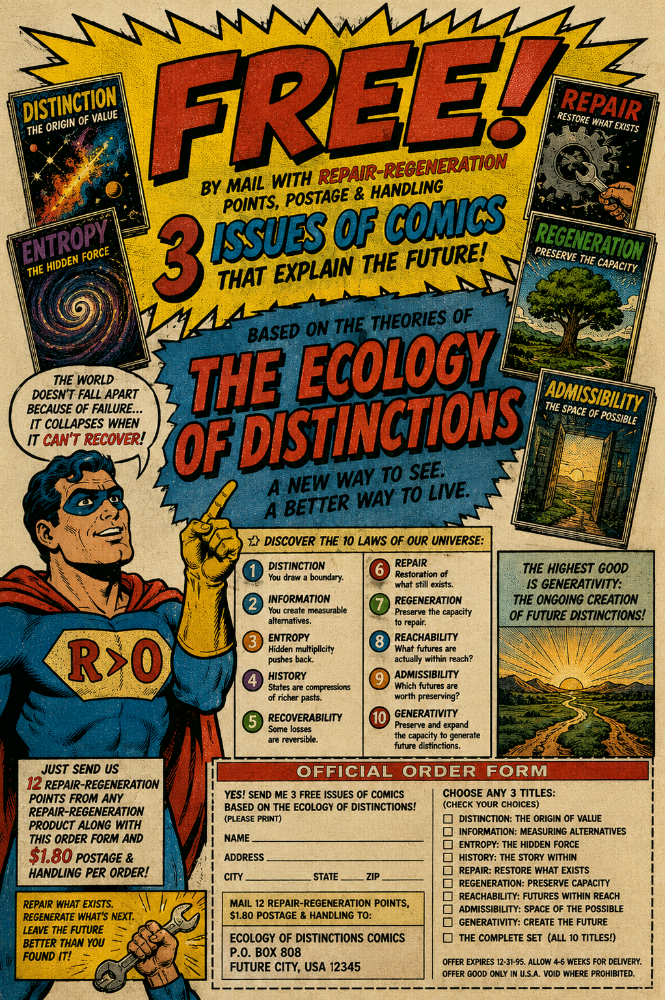

[The Ecology of Distinctions](https://standardgalactic.github.io/research-projects/textbook/The_Ecology_of_Distinctions.pdf)

<!--
* [Completion Plan](https://standardgalactic.github.io/research-projects/textbook/completion-plan.pdf)
-->
* [Distinction Ecology](https://standardgalactic.github.io/research-projects/textbook/Distinction_Ecology.pdf)

* [Notes](https://standardgalactic.github.io/research-projects/textbook/Distinction_Ecology-notes.pdf)

[The Autonomy of Refusal](https://standardgalactic.github.io/research-projects/textbook/autonomy-of-refusal.pdf)
<!--
* [The Geometry of Exclusion](https://standardgalactic.github.io/research-projects/textbook/The_Geometry_of_Exclusion.pdf)
-->
[Audio Overviews](https://standardgalactic.github.io/research-projects/textbook/)

# Companion Essays to *The Autonomy of Refusal*

This directory contains a collection of short essays that introduce, summarize, and reinterpret the ideas developed in **The Autonomy of Refusal** from different perspectives.

These are **not** the primary work. Rather, they are companion pieces intended for different audiences and domains. Some are written as conceptual introductions, others as popular science essays, while others explore how the framework applies to software engineering, learning theory, and organizational design. Collectively they provide multiple entry points into the larger theory without requiring readers to begin with the full manuscript.

## Essays

### [The Universe Says No: Why Reality Is Built on Refusal, Not Substance](blog-post.md)

A popular introduction to the central philosophical inversion of *The Autonomy of Refusal*. It explains the transition from a substance-first worldview to a constraint-first worldview using accessible examples drawn from nature, learning, artificial intelligence, and physics.

### [The Architecture of Refusal: A Primer on the First Inversion](conceptual-primer.md)

A conceptual overview of the book's foundational ideas. It introduces the First Inversion, the ontology of residues, distinguishability through exclusion, and the role of constraints in generating stable structure.

### [The Art of Selective Blindness: A New Theory of Learning](learning-theory.md)

An educational interpretation of the framework. This essay explains learning as the progressive elimination of incorrect possibilities, relating the theory to synaptic pruning, expertise, attention, and cognitive development.

### [Systems Design Manifesto: The Architecture of Deliberate Impossibility](systems-design.md)

An application of the framework to software architecture. It argues that robust systems are created by making undesirable states structurally impossible rather than merely unlikely, connecting the theory to type systems, modularity, verification, and technical debt.

### [Institutional Analysis Framework: The Geometry of Coordinated Refusal](institutional-analysis.md)

An application of the framework to organizations and leadership. It interprets institutions as persistent coordination structures maintained through governance, shared constraints, and accumulated histories of successful exclusion.

## About These Essays

Each essay emphasizes a different aspect of *The Autonomy of Refusal*, but they all develop the same central idea: that stable structure emerges through the systematic exclusion of alternatives rather than through the accumulation of substance or capability.

They are intended as introductions, summaries, explanatory reports, and domain-specific interpretations that complement the main manuscript rather than replace it.

<!--

-->
