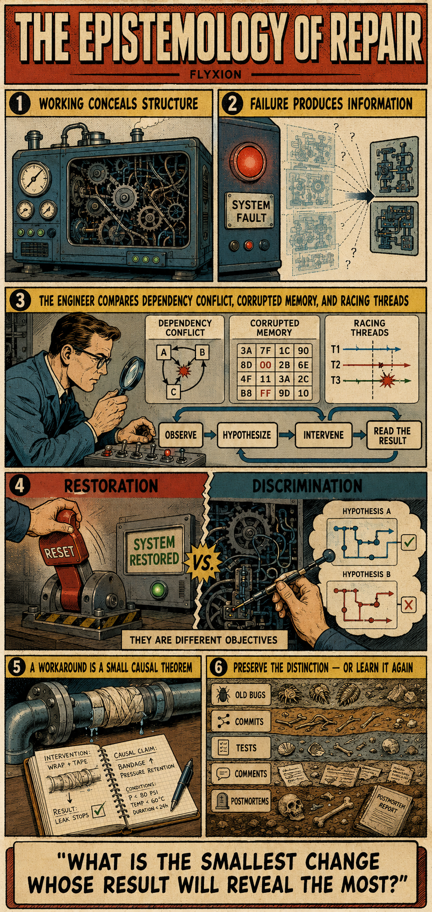

[Distinction Holonomy](https://standardgalactic.github.io/research-projects/unsorted/distinction-holonomy.pdf)

<!--
* [Notes](https://standardgalactic.github.io/research-projects/unsorted/Distinction_Holonomy.pdf)
-->
[The Epistemology of Repair](https://standardgalactic.github.io/research-projects/unsorted/epistemology-of-repair.pdf)

<!--
* [Notes](https://standardgalactic.github.io/research-projects/unsorted/Epistemic_Repair.pdf)
-->
[Sparse Recursion for Holographic Steganography](https://standardgalactic.github.io/research-projects/unsorted/sparse-recursive-holographic-steganography.pdf)

<!--
* [Notes](https://standardgalactic.github.io/research-projects/unsorted/Sparse_Recursion_Is_All_You_Need.pdf)
* [Notes](https://standardgalactic.github.io/research-projects/unsorted/Sparse_Recursive_Holographic_Steganography.pdf)
-->

